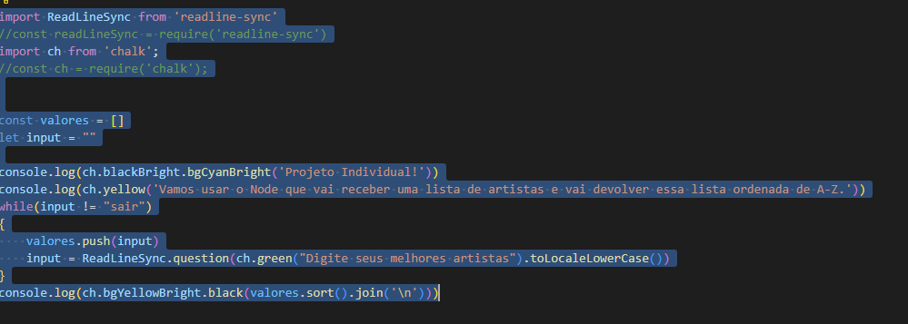
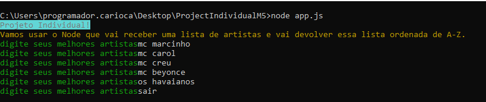

[](https://git.io/typing-svg)

<h3> ➡️ O Projeto consiste na ordenação alfabética de propriedades de CSS. <p> </h3>
<h2> 👾Código: </h2>
<h4> É construído em Javascript especificando de modo que no terminal seja realizada a aplicação do código. O código deve rodar em um laço que vai receber propriedades até a pessoa digitar a palavra SAIR, quando isso acontecer vai ser impresso no terminal a lista das propriedades ordenadas de A-Z uma em cada linha.</h4>




<h2>⌨️ Executando o projeto: <h2>
É efetuado para que a possamos puxar a documentação e fazer o teste de nossa aplicação na seguinte ordem: <p> 
 
 ### Clone o Repositório 
 
 ```bash
 $ git clone https://github.com/MariDutra/ProjectIndividualM5/
 ```
 
 ### Utilize os códigos abaixo em seu terminal para verificar o funcionamento do projeto 
 <p>NPM I</p>
 <p>NPM INIT</p>
 <p>NPM I -G CHALK</p>
 <p>NPM I READLINE-SYNC</p>
 <p>NODE APP.JS</p>
 
 
 
 
 <h2>🔠Node.js</h2>
<h4>Através do Node.js é realizado a contrução do código que recebe uma lista de propriedades decoradas atraves da ferramenta CSS e devolve essa lista ordenada de A-Z.</h4>
 
 
 
 
 
 Trabalho Individual - Modulo 5 - Resilia/ Senac Rio.


